# Adaptive Edge-Inference Controller

<p align="center">
  
  
  
  
  
</p>

**Thermal-aware dynamic scaling for YOLO inference on NVIDIA Jetson-class edge AI devices.**

Running YOLO and real-time vision workloads on Jetson-class edge devices is not only a peak-performance problem; it is a long-duration reliability problem. In security cameras, robotic platforms, drones, and unattended field systems expected to operate continuously for 24, 48, or more hours, sustained inference load can gradually increase thermal stress and reduce system stability. In such deployments, the main challenge is not whether the device can run the model for a short demo, but whether it can remain stable, responsive, and thermally safe throughout long-term operation.

Although a cooling fan is useful, it is not always sufficient on its own. A fixed-speed or manually controlled fan cannot always react effectively to changing workload intensity, ambient temperature, enclosure conditions, airflow limitations, or sudden thermal spikes. Therefore, long-running edge AI systems need an adaptive thermal control mechanism that continuously monitors temperature and adjusts cooling behavior according to real-time conditions. Adaptive Edge AI Controller addresses this challenge by dynamically managing fan operation, reducing unnecessary heat accumulation, minimizing the risk of throttling, freezes, shutdowns, and human intervention, and helping Jetson-based AI systems operate more reliably and sustainably in field conditions.

Adaptive Edge-Inference Controller adds an application-level control layer that monitors GPU temperature in real time, predicts near-future thermal pressure using an FOPDT-based model, and dynamically adjusts YOLO inference workload — **before** sustained heat causes throttling, unstable latency, frame drops, freezes, or shutdowns. The result: a 130-minute continuous run without a single emergency shutdown, while the system autonomously adapts resolution and frame processing ratio across safe, warning, and critical thermal regions.

<p align="center">
  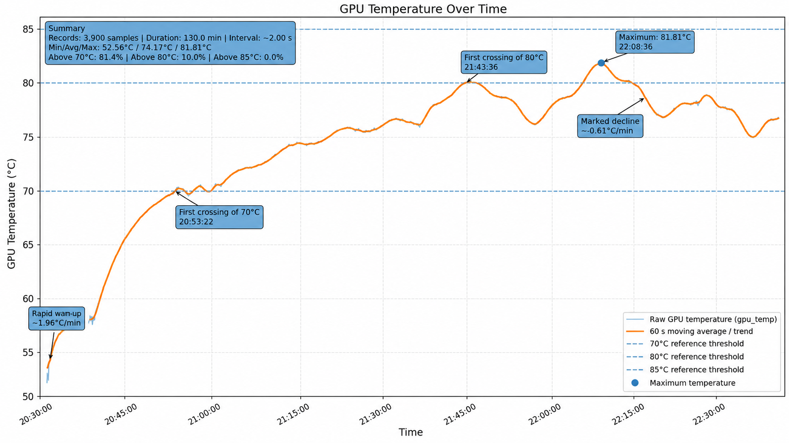
</p>

<p align="center"><em>Live demonstration overlay showing the controller in action on a Jetson device: real-time GPU temperature (measured, predicted, and control), FPS, GPU/CPU load, current operating mode (safe → warning → critical), inference frame ratio, and dynamically adjusted YOLO input size — all rendered as an on-screen heads-up display during active human detection.</em></p>

<p align="center">
  <a href="https://www.youtube.com/watch?v=HjrYveYYfWo">
    
  </a>
</p>

<p align="center"><em>📹 Full demonstration video: Adaptive Edge AI Controller running a closed-loop YOLO human-detection pipeline on Jetson hardware for over 2 hours, showing thermal adaptation across all operating modes.</em></p>

---

<details>
<summary><strong>📑 Table of Contents</strong> (click to expand)</summary>

- [Key demo outcomes](#key-demo-outcomes)
- [With controller vs. without controller](#with-controller-vs-without-controller)
- [The problem: thermal instability in edge AI deployments](#the-problem-thermal-instability-in-edge-ai-deployments)
- [What the project does](#what-the-project-does)
- [Operating modes](#operating-modes)
- [System architecture](#system-architecture)
- [Closed-loop control mechanism](#closed-loop-control-mechanism)
- [Technologies and layers](#technologies-and-layers)
- [Experimental results](#experimental-results)
  - [Closed-loop adaptive demo](#closed-loop-adaptive-demo)
  - [FPS percentage experiment](#fps-percentage-experiment)
  - [Resolution scaling experiment](#resolution-scaling-experiment)
  - [Offline FOPDT identification](#offline-fopdt-identification)
- [Use cases](#use-cases)
- [Repository structure](#repository-structure)
- [Setup](#setup)
- [Configuration](#configuration)
- [Quick start](#quick-start)
- [Manual checks](#manual-checks)
- [Runtime output](#runtime-output)
- [Full technical report and demo video](#full-technical-report-and-demo-video)
- [References and field evidence](#references-and-field-evidence)
- [Known limitations](#known-limitations)
- [License](#license)

</details>

---

## Key demo outcomes

The closed-loop demonstration experiment ran for approximately **130 minutes** and recorded **3,900 telemetry samples**. The system moved through safe, warning, and critical thermal regions while the controller autonomously adjusted inference parameters — and **never triggered the emergency shutdown**.

| Result | Value |
| --- | ---: |
| Closed-loop demo duration | **~130 minutes** |
| Logged telemetry samples | **3,900** |
| GPU temperature range | 52.56 °C – 81.82 °C |
| Average GPU temperature | 74.17 °C |
| First 70 °C crossing | ~22.1 min |
| First 80 °C crossing | ~72.3 min |
| Share of run above 80 °C | 10.0% |
| 85 °C hard emergency threshold exceeded? | **No** |
| Emergency mode triggered? | **No** |

The controller proactively reduces workload as temperature rises: in the warning region, average `imgsz` drops and `percentage` is throttled; in the critical region, the system enforces stronger reduction. Despite reaching 81.82 °C, the emergency band (85 °C) was never entered — demonstrating that application-level thermal awareness can prevent the most severe degradation scenarios.

## With controller vs. without controller

What happens when you run YOLO on a Jetson device for an extended period — with and without the Adaptive Edge-Inference Controller?

| | ❌ Without controller | ✅ With controller |
| --- | --- | --- |
| **Thermal behavior** | Temperature rises unchecked until kernel throttling or shutdown | Temperature is proactively managed; stays below emergency threshold |
| **FPS stability** | Starts stable, then becomes erratic as DVFS throttling kicks in | Controlled trade-off: FPS is deliberately adjusted to maintain thermal stability |
| **System uptime** | Risk of freeze or shutdown after 15–60+ minutes | Continuous operation for 130+ minutes demonstrated without emergency events |
| **Quality degradation** | Unpredictable — the OS decides what degrades and when | Controlled — The application decides how much to reduce or increase the resolution and frame rate |
| **Recovery** | Manual restart required after freeze/shutdown | Automatic — workload is restored when temperature returns to safe region |
| **Operator intervention** | Required — someone must notice and restart the system | Not required — the system self-regulates autonomously |

> 💡 The key difference: **without** the controller, the system passively waits for hardware-level throttling or failure. **With** the controller, the application actively manages its own workload to prevent those scenarios entirely.

## The problem: thermal instability in edge AI deployments

Real-time object detectors such as YOLO continuously exercise GPU, CPU, memory, and image-processing resources. On compact edge devices like NVIDIA Jetson, this sustained computational load generates significant heat within a small form factor with limited cooling capacity and constrained power budgets.

A YOLO pipeline may run correctly at startup — but after minutes or hours of continuous operation, heat accumulates and the system begins to degrade:

- 🌡️ **Thermal throttling and unstable FPS** — The OS triggers clock throttling via DVFS, degrading inference speed unpredictably
- ⏱️ **Latency accumulation** — Video pipeline latency grows as the GPU struggles under thermal pressure
- 🖼️ **Dropped frames** — Detection responsiveness decreases as frames are skipped or delayed
- 🧊 **System freezes** — The entire system locks up, requiring physical manual restart
- ⛔ **Thermal shutdowns** — The device shuts down entirely to protect hardware

This is especially critical for unattended Jetson deployments: security cameras, traffic analytics nodes, mobile robots, UAVs, industrial monitoring devices, and outdoor AI sensors — scenarios where physical intervention is costly or impossible.

### This is not a theoretical problem — real users are reporting it

Developer forums and open-source issue trackers consistently document these exact failures in production Jetson and edge AI deployments:

| Source | Reported Problem | Implication |
| --- | --- | --- |
| [**NVIDIA Forum — YOLOv8 on Jetson Nano**](https://forums.developer.nvidia.com/t/yolov8-on-jetson-nano/265650) | GPU temperature rises to ~70 °C after ~10 minutes of YOLOv8 inference, creating concern for outdoor autonomous use | Long-duration outdoor operation needs temperature-trend-aware adaptive control |
| [**NVIDIA Forum — Overheating shutdown**](https://forums.developer.nvidia.com/t/overheating-shut-down-jetson-nano/80693) | Device shuts down after 15–20 minutes of real-time object detection from RTSP stream; heatsink becomes excessively hot | Model execution alone is not enough — operational continuity and thermal safety must be managed together |
| [**Ultralytics Community — System freeze under heavy YOLO**](https://community.ultralytics.com/t/system-freeze-when-performing-heavy-yolo-inferencing/1882) | System freezes completely within 1–2 hours under multi-camera YOLO inferencing, requiring manual restart | Freezing that requires manual intervention is a critical risk for unattended/remote systems |
| [**NVIDIA Forum — DeepStream nvinfer delay**](https://forums.developer.nvidia.com/t/delay-due-to-nvinfer/324632) | Temperature and latency accumulation in a DeepStream pipeline; drop-frame/interval settings reduce both | The processed-frame ratio is a practical thermal-control lever that directly changes system behavior |
| [**NVIDIA Forum — Jetson Nano freeze while detecting**](https://forums.developer.nvidia.com/t/jetson-nano-freezes-while-detecting/214700) | YOLO + OpenCV + Python system freezes after running for some time | Runtime monitoring and proactive throttling are essential for stability |
| [**NVIDIA Forum — DeepStream thermal throttle at 68–70 °C**](https://forums.developer.nvidia.com/t/deepstream-7-1-on-jetson-orin-nano-super-3-stream-pipeline-thermal-throttle-at-68-70-c-seeking-fps-optimization-advice/364742) | Jetson Orin Nano Super user reports thermal throttling around 68–70 °C in a DeepStream pipeline | Even newer Jetson hardware faces thermal constraints during sustained inference |

> 💡 **Additional field evidence**: [detectnet-camera crashes and 5W mode workarounds](https://forums.developer.nvidia.com/t/jetson-nano-crashing-while-using-detectnet-camera-demo-from-jetson-inference/74384), [TensorFlow over-current throttling](https://forums.developer.nvidia.com/t/power-error-while-using-tensorflow/181327), [long-running Jetson Nano overheating](https://forums.developer.nvidia.com/t/jetson-nano-long-run-over-heat/157545), and [jetson-inference high temperature / shutdown](https://github.com/dusty-nv/jetson-inference/issues/1473) further confirm that this is a widespread, recurring problem across different frameworks and Jetson generations.

NVIDIA's own documentation acknowledges this reality: the Jetson BSP uses fan management and clock throttling for thermal cooling, and **reducing clock frequency directly affects performance and user experience** ([Jetson Power and Thermal Management](https://docs.nvidia.com/jetson/archives/r36.5/DeveloperGuide/SD/PlatformPowerAndPerformance/JetsonOrinNanoSeriesJetsonOrinNxSeriesAndJetsonAgxOrinSeries.html)).

### How this project addresses it

Adaptive Edge-Inference Controller addresses this gap by adding a **software control layer above the inference loop**. Instead of passively waiting for the kernel-level thermal throttling to degrade performance unpredictably, the application:

1. **Monitors** GPU temperature, GPU/CPU load, and FPS in real time
2. **Predicts** near-future thermal pressure using an FOPDT-inspired model
3. **Decides** the optimal inference workload through fuzzy logic
4. **Acts** by adjusting YOLO input resolution and frame processing ratio
5. **Guards** against critical thermal states with a safety layer

The result is **controlled, measurable quality degradation** rather than unpredictable system failure — and **automatic recovery** when thermal conditions improve.

## What the project does

The controller combines real-time telemetry, short-horizon thermal prediction, fuzzy decision logic, and a safety guard:

1. Read Jetson GPU temperature, GPU load, CPU load, and live FPS.
2. Store recent telemetry in a ring buffer.
3. Estimate the current thermal trend.
4. Predict near-future control temperature with an FOPDT-inspired predictor.
5. Use fuzzy logic to choose an inference workload.
6. Apply a safety guard for critical and emergency thermal states.
7. Log every control step to CSV for analysis and reproducibility.

The controller changes two inference workload levers:

| Lever | Meaning | Effect |
| --- | --- | --- |
| `imgsz` | YOLO input image size | Reduces per-frame compute cost |
| `percentage` | Fraction of frames sent to inference | Reduces inference frequency / effective workload |

## Operating modes

| Mode | Approximate condition | Behavior |
| --- | --- | --- |
| `safe` | Below warning region | Full-quality inference: `imgsz=640`, `percentage=1.0` |
| `warning` | Around 70 °C and above | Gradually reduce workload through fuzzy control |
| `critical` | Around 80 °C and above | Stronger reduction through fuzzy control |
| `emergency` | 85 °C hard limit | Force emergency action: `imgsz=320`, `percentage=0.25` |

The default thresholds are defined in [`examples/configs/default.yaml`](examples/configs/default.yaml).

## System architecture

<p align="center">
  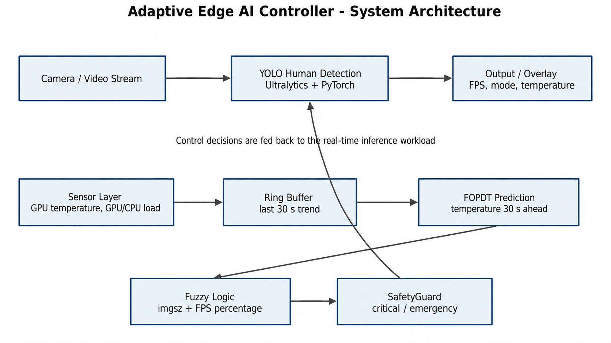
</p>

The runtime path is implemented as:

```text
examples/basic_yolo_jetson.py
  -> thermal_edge.config.ControllerConfig
  -> thermal_edge.control.controller.AdaptiveController
  -> thermal_edge.sensors.thermal_zone / gpu_load
  -> thermal_edge.telemetry.RingBuffer
  -> thermal_edge.control.fopdt.FopdtThermalPredictor
  -> thermal_edge.control.fuzzy.ThermalFuzzyController
  -> thermal_edge.control.safety.SafetyGuard
  -> thermal_edge.telemetry.CsvLogger
```

## Closed-loop control mechanism

<p align="center">
  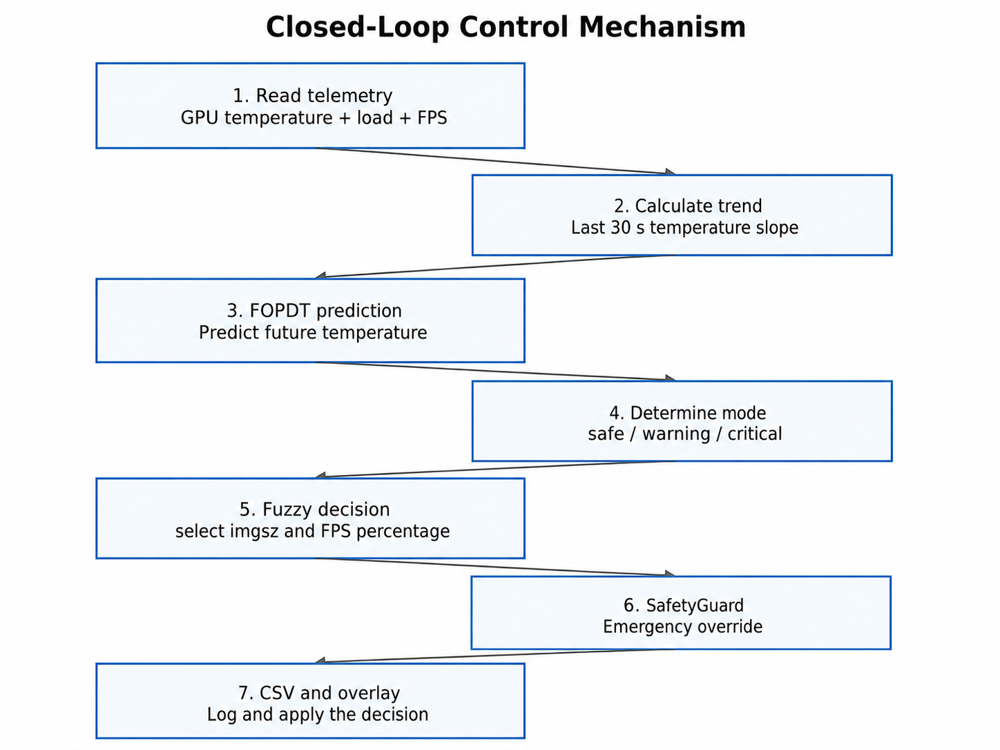
</p>

The inference loop reads the latest controller action before each frame. The controller runs in a background thread, updates telemetry periodically, and publishes the current `imgsz` and `percentage` decision.

## Technologies and layers

<p align="center">
  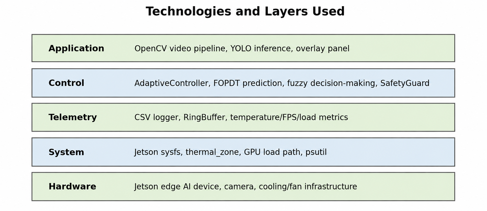
</p>

Codebase-verified technologies include:

- Python
- Ultralytics YOLO
- PyTorch
- OpenCV
- NumPy
- scikit-fuzzy
- PyYAML
- psutil
- Jetson sysfs thermal/load telemetry
- GStreamer camera pipeline for Jetson CSI cameras

PyTorch, OpenCV, CUDA, and camera support on Jetson depend on the JetPack version and installed platform packages.

## Experimental results

### Closed-loop adaptive demo

Source data: [`experiments/closed_loop_demo/adaptive_edge_demo.csv`](experiments/closed_loop_demo/adaptive_edge_demo.csv)

<p align="center">
  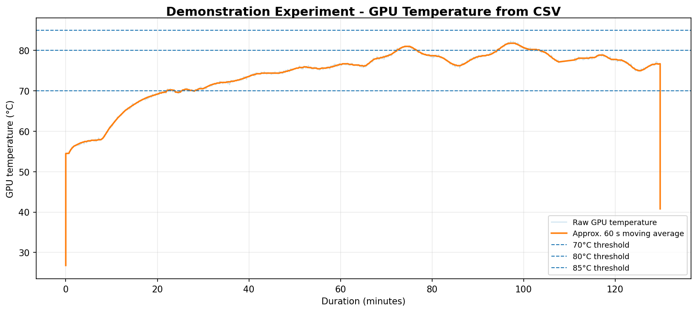
</p>

<p align="center"><em>GPU temperature over the full ~130-minute closed-loop run. The annotated plot shows the rapid warm-up phase (~1.96 °C/min), threshold crossings at 70 °C and 80 °C, the maximum temperature point (81.81 °C), and the marked decline (~0.61 °C/min) when the controller applied stronger workload reduction.</em></p>

| Metric | Value |
| --- | ---: |
| Samples | 3,900 |
| Duration | ~129.97 min |
| GPU temperature range | 52.562 °C to 81.815 °C |
| Average GPU temperature | 74.1666 °C |
| First 70 °C crossing | ~22.101 min |
| First 80 °C crossing | ~72.335 min |
| Share of run above 80 °C | 10.0% |
| 85 °C exceeded | No |

<p align="center">
  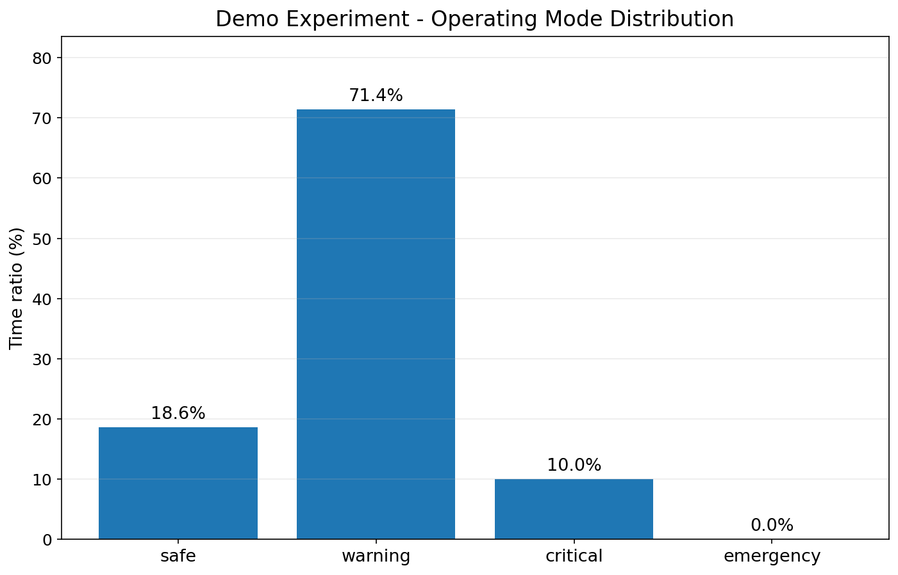
</p>

<p align="center"><em>Distribution of operating modes during the closed-loop demo. The controller spent the majority of the run in warning mode (71.4%), with safe (18.6%) at the beginning and critical (10.0%) during peak thermal periods — demonstrating genuine thermal region traversal.</em></p>

| Mode | Samples | Share |
| --- | ---: | ---: |
| `safe` | 726 | 18.6% |
| `warning` | 2,784 | 71.4% |
| `critical` | 390 | 10.0% |

This is a sustained adaptive run rather than a short startup snapshot. The system moves through all three active thermal regions while keeping the run below the hard emergency threshold — confirming that proactive application-level control can maintain stable operation where uncontrolled inference would risk throttling, freezing, or shutdown.

### FPS percentage experiment

Source data: [`experiments/fps_percentage/fps.csv`](experiments/fps_percentage/fps.csv)

This experiment isolates the effect of the `percentage` control lever by changing the processed-frame ratio from `1.0` (every frame inferred) to `0.25` (1 in 4 frames inferred) while keeping resolution fixed at 640.

| Phase | Avg GPU temp | Avg FPS | Avg GPU load | Avg CPU load |
| --- | ---: | ---: | ---: | ---: |
| `percentage=1.0` | 56.47 °C | 24.06 | 72.88% | 19.10% |
| `percentage=0.25` | 54.63 °C | 8.34 | 26.39% | 10.70% |

**Key takeaway:** Frame-percentage reduction is the **strongest thermal actuator** in the shared experiments — GPU load drops from 72.9% to 26.4% and temperature decreases by ~1.85 °C. However, it has an explicit throughput cost (FPS drops from 24 to 8.3), making it the controller's primary lever for critical thermal situations.

**Thermal response:**

<p align="center">
  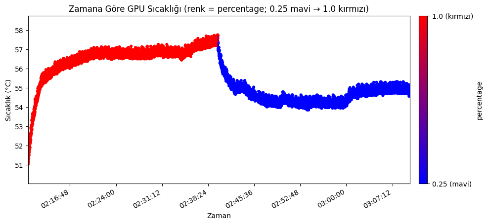
</p>

<p align="center"><em>GPU temperature over time, color-coded by frame-processing percentage (red = 1.0, blue = 0.25). The clear temperature drop after the percentage reduction demonstrates the thermal relief effect.</em></p>

**GPU load response:**

<p align="center">
  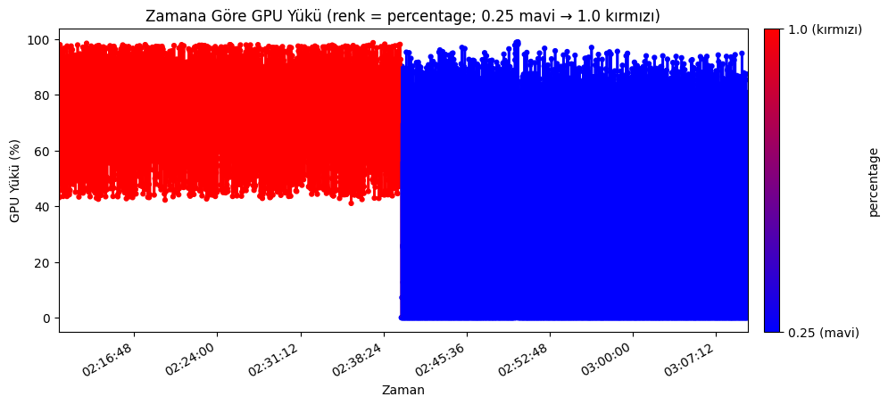
</p>

<p align="center"><em>GPU load over time. Reducing the processed-frame ratio from 1.0 to 0.25 dramatically reduces GPU utilization from ~90-99% to ~40-90%, confirming that frame-percentage is the strongest workload lever.</em></p>

**CPU load response:**

<p align="center">
  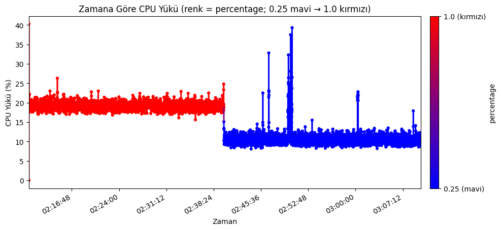
</p>

<p align="center"><em>CPU load also decreases when the frame-processing ratio is reduced, from ~18-20% down to ~10-12%.</em></p>

### Resolution scaling experiment

Source data: [`experiments/resolution_scaling/resolution.csv`](experiments/resolution_scaling/resolution.csv)

This experiment isolates the effect of the `imgsz` control lever by changing the YOLO input resolution from `640` to `320` while keeping the frame-processing ratio at `1.0`.

| Phase | Avg GPU temp | Avg FPS | Avg GPU load | Avg CPU load |
| --- | ---: | ---: | ---: | ---: |
| `resolution=640` | 57.15 °C | 23.75 | 71.03% | 18.98% |
| `resolution=320` | 55.99 °C | 25.87 | 67.04% | 19.11% |

**Key takeaway:** Reducing `imgsz` gives a milder thermal reduction than frame-percentage limiting, but it can **preserve or even improve throughput** by lowering per-frame compute cost — making it an ideal fine-tuning lever for the controller.

**Thermal response:**

<p align="center">
  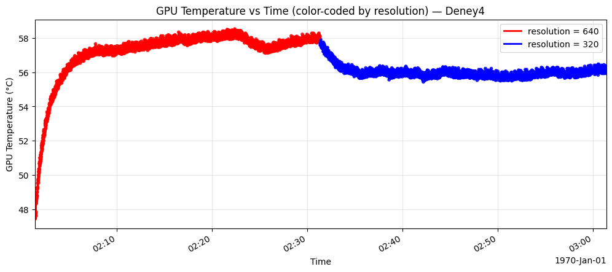
</p>

<p align="center"><em>GPU temperature over time, color-coded by resolution (red = 640, blue = 320). The temperature drop after switching to 320 is visible but milder compared to the FPS percentage experiment.</em></p>

**GPU load response:**

<p align="center">
  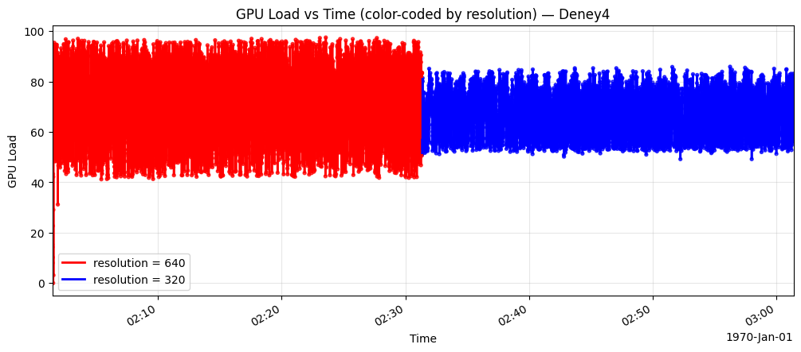
</p>

<p align="center"><em>GPU load over time. Resolution reduction lowers peak GPU utilization modestly, while the overall load pattern remains more consistent than in the FPS percentage experiment.</em></p>

**CPU load response:**

<p align="center">
  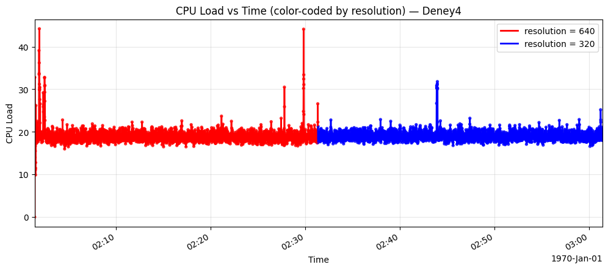
</p>

<p align="center"><em>CPU load remains largely unchanged between resolution settings, confirming that resolution scaling primarily affects GPU workload rather than CPU utilization.</em></p>

### Offline FOPDT identification

Offline identification results are stored in [`thermal_edge/control/fopdt_fit_results.json`](thermal_edge/control/fopdt_fit_results.json).

| Step experiment | K | Tau | Theta | RMSE | R² |
| --- | ---: | ---: | ---: | ---: | ---: |
| FPS percentage step | 3.96 °C/u | 119.1 s | 0.0 s | 0.154 °C | 0.936 |
| Image-size step | 2.50 °C/u | 82.3 s | 5.2 s | 0.076 °C | 0.963 |

Important: these are offline identification results. The current runtime predictor is FOPDT-inspired and uses configured parameters from [`examples/configs/default.yaml`](examples/configs/default.yaml); it does not automatically load `fopdt_fit_results.json`.

## Use cases

This project is relevant when an edge AI workload must remain stable for long-running deployments under constrained cooling:

- smart surveillance and security cameras,
- human, vehicle, or license-plate detection at the edge,
- traffic and parking analytics,
- mobile robots and UAVs,
- industrial safety monitoring,
- outdoor sensor nodes,
- unattended remote Jetson deployments.

The repository includes example model weights under [`models/`](models/), but no accuracy benchmark is claimed in this README.

## Repository structure

```text
.
├── docs/
│   └── Adaptive_Edge_AI_Controller_Report.pdf
├── examples/
│   ├── basic_yolo_jetson.py
│   └── configs/default.yaml
├── experiments/
│   ├── closed_loop_demo/
│   ├── fps_percentage/
│   └── resolution_scaling/
├── images/
│   └── README figures and result visuals
├── models/
│   └── sample .pt model weights
├── tests/manual/
│   └── manual validation scripts
└── thermal_edge/
    ├── config.py
    ├── control/
    ├── sensors/
    └── telemetry/
```

## Setup

This repository includes a Jetson-focused [`requirements.txt`](requirements.txt). It intentionally avoids pip OpenCV, generic pip PyTorch, and generic pip torchvision because those packages can replace JetPack-compatible builds on Jetson.

On Jetson, create an environment that can see JetPack system packages:

```bash
python3 -m venv --system-site-packages .venv
source .venv/bin/activate
```

On non-Jetson systems, a regular environment is fine:

```bash
python -m venv .venv
source .venv/bin/activate
```

On Windows PowerShell:

```powershell
python -m venv .venv
.\.venv\Scripts\Activate.ps1
```

On Jetson, install PyTorch and torchvision using NVIDIA/JetPack-compatible wheels or packages for your exact JetPack/CUDA version. Do not install generic pip `torch` or `torchvision` unless you have verified that those wheels are compatible with your Jetson image.

Install the pip-safe Python dependencies:

```bash
python3 -m pip install --upgrade pip
python3 -m pip install -r requirements.txt
```

Install Ultralytics without dependency resolution so pip does not pull `opencv-python`:

```bash
python3 -m pip install --no-deps ultralytics==8.4.53 ultralytics-thop==2.0.18
```

### Jetson OpenCV and GStreamer warning

If the camera is opened through GStreamer, OpenCV must be built with GStreamer support. On Jetson this should normally be the OpenCV build that comes with JetPack/L4T. Do not install `opencv-python`, `opencv-contrib-python`, or `opencv-python-headless` from pip for the Jetson GStreamer camera path, because those wheels can shadow the JetPack OpenCV build and break `cv2.CAP_GSTREAMER`.

If a pip OpenCV package is already installed, remove it:

```bash
python3 -m pip uninstall -y opencv-python opencv-contrib-python opencv-python-headless
```

After removing pip OpenCV, Python should fall back to the JetPack-provided `cv2` module when the environment can access system site packages. This is also the expected OpenCV build for the Jetson GPU/GStreamer camera workflow used by this project.

Verify the active OpenCV build:

```bash
python3 - <<'PY'
import cv2

print(cv2.__file__)
print(cv2.__version__)
for line in cv2.getBuildInformation().splitlines():
    if "GStreamer" in line:
        print(line)
PY
```

## Configuration

Default configuration lives at [`examples/configs/default.yaml`](examples/configs/default.yaml).

Important fields:

| Field | Purpose |
| --- | --- |
| `controller.target_temp` | Desired thermal operating target |
| `controller.critical_temp` | Critical control threshold |
| `controller.hard_critical_temp` | Emergency threshold |
| `controller.control_interval` | Background controller interval |
| `telemetry.log_path` | CSV output path |
| `camera.width`, `camera.height`, `camera.fps` | Camera pipeline settings |
| `yolo.model_path` | YOLO model path |
| `yolo.confidence`, `yolo.iou` | Detection thresholds |

Before running the live demo, update `yolo.model_path` to an existing model file. The current config points to `insan_tespit_mdeli.pt`, while this repository currently includes model files such as:

- [`models/best_human.pt`](models/best_human.pt)
- [`models/best_car.pt`](models/best_car.pt)
- [`models/best_plaka_plate.pt`](models/best_plaka_plate.pt)

Example:

```yaml
yolo:
  model_path: "models/best_human.pt"
  confidence: 0.70
  iou: 0.45
```

## Quick start

Run a controller dry run without opening the camera or loading YOLO:

```bash
python examples/basic_yolo_jetson.py --dry-run
```

Run the default Jetson CSI/GStreamer demo:

```bash
python examples/basic_yolo_jetson.py --config examples/configs/default.yaml
```

Run with a USB camera or video source:

```bash
python examples/basic_yolo_jetson.py --camera usb --source 0
```

Run for a bounded number of frames:

```bash
python examples/basic_yolo_jetson.py --max-frames 300
```

Press `q` in the OpenCV window to quit the live demo.

## Manual checks

```bash
python tests/manual/test_fopdt_predictor.py
python tests/manual/test_controller_mock_loop.py
python tests/manual/test_demo_preflight_windows.py
```

These are manual validation scripts rather than a full CI test suite.

## Runtime output

The live overlay shows:

- measured GPU temperature,
- predicted temperature,
- control temperature,
- temperature trend,
- display FPS,
- selected `imgsz`,
- selected `percentage`,
- operating mode,
- GPU and CPU load,
- whether the current frame is inferred,
- frame index.

The CSV logger writes:

```text
timestamp,gpu_temp,gpu_load,cpu_load,fps,imgsz,percentage,temp_delta,mode
```

## Full technical report and demo video

The full project report is available at:

- 📚 [`docs/Adaptive_Edge_AI_Controller_Report.pdf`](docs/Adaptive_Edge_AI_Controller_Report.pdf) — Contains the complete motivation, problem analysis, system design, experimental methodology, results discussion, and formal bibliography.

The live demonstration video is available on YouTube:

- 🎥 [**Adaptive Edge AI Controller — Results Demonstration Video**](https://www.youtube.com/watch?v=HjrYveYYfWo) — Shows the controller running a YOLO human-detection pipeline on Jetson hardware for over 2 hours, with real-time thermal adaptation across all operating modes.

## References and field evidence

The problem definition and solution approach in this project are supported by community reports, official documentation, and field-reported user issues. These references are discussed in context in the [problem definition section](#the-problem-thermal-instability-in-edge-ai-deployments) above and in the [full technical report](docs/Adaptive_Edge_AI_Controller_Report.pdf).

### Community forum reports

| Ref | Source | Summary |
| --- | --- | --- |
| F1 | [NVIDIA Forum](https://forums.developer.nvidia.com/t/yolov8-on-jetson-nano/265650) | YOLOv8 on Jetson Nano — temperature rises to ~70 °C after ~10 min |
| F2 | [NVIDIA Forum](https://forums.developer.nvidia.com/t/overheating-shut-down-jetson-nano/80693) | Jetson Nano shuts down after 15–20 min of RTSP object detection |
| F3 | [Ultralytics Community](https://community.ultralytics.com/t/system-freeze-when-performing-heavy-yolo-inferencing/1882) | System freeze under multi-camera YOLO inferencing (1–2 hours) |
| F4 | [NVIDIA Forum](https://forums.developer.nvidia.com/t/delay-due-to-nvinfer/324632) | DeepStream nvinfer delay and latency accumulation |
| F5 | [GitHub Issue](https://github.com/dusty-nv/jetson-inference/issues/1473) | jetson-inference high temperature / shutdown |
| F6 | [NVIDIA Forum](https://forums.developer.nvidia.com/t/jetson-nano-long-run-over-heat/157545) | Long-running Jetson Nano overheating |
| F7 | [NVIDIA Forum](https://forums.developer.nvidia.com/t/jetson-nano-crashing-while-using-detectnet-camera-demo-from-jetson-inference/74384) | detectnet-camera crashes; 5W mode workaround |
| F8 | [NVIDIA Forum](https://forums.developer.nvidia.com/t/power-error-while-using-tensorflow/181327) | TensorFlow over-current throttling |
| F9 | [NVIDIA Forum](https://forums.developer.nvidia.com/t/jetson-nano-freezes-while-detecting/214700) | Jetson Nano freezes during YOLO + OpenCV detection |
| F10 | [NVIDIA Forum](https://forums.developer.nvidia.com/t/deepstream-7-1-on-jetson-orin-nano-super-3-stream-pipeline-thermal-throttle-at-68-70-c-seeking-fps-optimization-advice/364742) | DeepStream thermal throttling at 68–70 °C on Jetson Orin Nano Super |

### NVIDIA official documentation

| Ref | Source | Summary |
| --- | --- | --- |
| W1 | [Jetson Orin Nano Developer Kit User Guide](https://developer.nvidia.com/embedded/learn/jetson-orin-nano-devkit-user-guide/index.html) | Positions Jetson for AI robots, drones, and smart cameras |
| W2 | [NVIDIA Autonomous Machines / Jetson Platform](https://www.nvidia.com/en-us/autonomous-machines/) | Jetson for robotics, drones, video analytics, autonomous machines |
| W4 | [tegrastats Utility](https://docs.nvidia.com/jetson/archives/r36.2/DeveloperGuide/AT/JetsonLinuxDevelopmentTools/TegrastatsUtility.html) | Memory and processor statistics reporting on Jetson |
| W5 | [Jetson Power and Thermal Management](https://docs.nvidia.com/jetson/archives/r36.5/DeveloperGuide/SD/PlatformPowerAndPerformance/JetsonOrinNanoSeriesJetsonOrinNxSeriesAndJetsonAgxOrinSeries.html) | Fan management, clock throttling, and thermal cooling documentation |

## Known limitations

- Jetson setup depends on JetPack-compatible OpenCV, PyTorch, and torchvision builds; `requirements.txt` deliberately avoids replacing those platform packages.
- The default `yolo.model_path` must be changed before running the live demo with the current repository contents.
- Jetson telemetry depends on sysfs paths that may vary across JetPack versions and board configurations.
- The default camera backend is Jetson CSI/GStreamer; desktop systems may need `--camera usb --source ...`.
- Offline FOPDT identification results are not automatically loaded by the current runtime predictor.
- The shared experiments evaluate thermal/performance behavior, not detection accuracy.
- Lowering `percentage` or `imgsz` trades thermal relief against temporal coverage, throughput, or detection quality.
- Emergency mode is implemented, but the shared closed-loop demo did not exceed the 85 °C emergency threshold.

## License

This project is licensed under the MIT License. See [`LICENSE`](LICENSE) for details.
