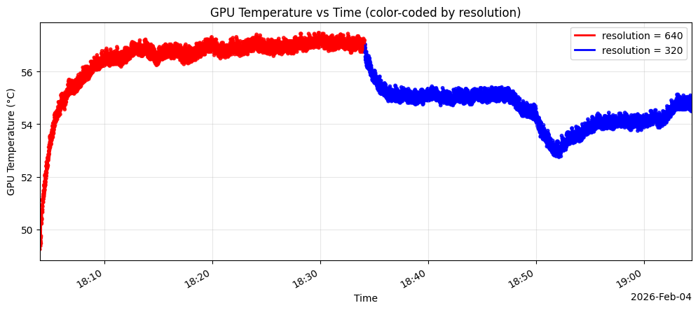
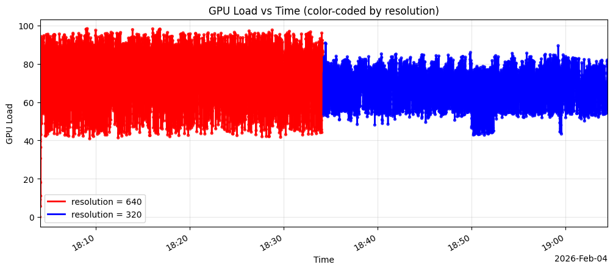
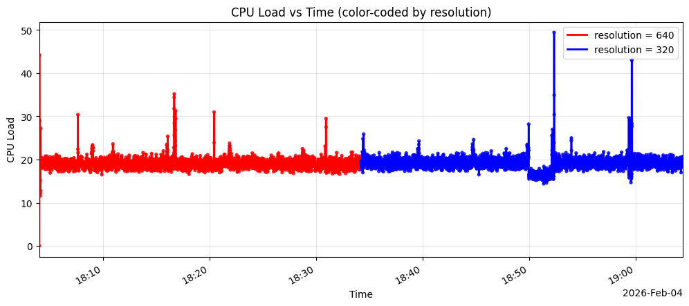

[English](README.md) | [Türkçe](README_TR.md)

# Adaptif Uç-Çıkarım Denetleyicisi: Termal Farkındalıklı Dinamik Ölçeklendirme
### NVIDIA Jetson Orin NX İçin Optimize Edildi | TÜBİTAK 2209-A Araştırma Projesi

Bu depo, Uç Yapay Zeka (Edge AI) uygulamalarında termal darboğazı (thermal throttling) önlemek ve güç tüketimini optimize etmek için tasarlanmış donanım-duyarlı bir kontrol katmanının geliştirme sürecini ve deneysel sonuçlarını içerir.

## 🚀 Projeye Genel Bakış
Jetson Orin NX gibi uç cihazlarda gerçekleştirilen yüksek performanslı çıkarım işlemleri, ciddi miktarda ısı oluşumuna neden olur. Sürekli yüksek sıcaklıklar **Termal Darboğaza** yol açarak sistem güvenilirliğini ve ömrünü azaltır.

Bu proje, şu bileşenleri kullanan bir **Adaptif Denetleyici** uygular:
- **FOPDT (First-Order Plus Dead Time) Modeli:** Gelecekteki sıcaklık trendlerini tahmin etmek için.
- **Bulanık Mantık (Fuzzy Logic) Denetleyicisi:** Gerçek zamanlı termal telemetri verilerine dayanarak **Çıkarım Çözünürlüğünü (imgsz)** ve **FPS** limitlerini dinamik olarak ayarlamak için.

## 📊 Deneysel Kavram Kanıtı (PoC)
Çözünürlük ve termal yük arasındaki korelasyonu doğrulamak için YOLOv8 kullanarak 60 dakikalık sürekli bir çıkarım deneyi gerçekleştirdim.

### Deney Protokolü:
- **Süre:** 60 Dakika (Sürekli)
- **Aşama 1 (0-30dk):** Sabit 640px çözünürlük.
- **Aşama 2 (30-60dk):** Sistem yeniden başlatılmadan arayüz üzerinden 320px çözünürlüğe geçiş.
- **Donanım:** NVIDIA Jetson Orin NX + Raspberry Pi HQ Kamera.

### Temel Bulgular:
- **Aşama 1:** GPU sıcaklığı ilk 30 dakika içinde **8°C** arttı.
- **Aşama 2:** 320px'e geçildikten sonra dakikalar içinde **3°C'lik bir düşüş** gözlemlendi ve ardından termal trend stabilize oldu.
- **Sonuç:** Dinamik çözünürlük ölçeklendirme, gerçek zamanlı termal yönetim için etkili bir araçtır.

## Matematiksel Arkaplan
FOPDT MODELİ:
$$G(s) = \frac{K}{Ts + 1} e^{-Ls}$$

## 🛠 Teknoloji Yığını
- **Donanım:** NVIDIA Jetson Orin NX
- **Diller:** Python (Async, Typing), C++ (Düşük seviyeli telemetri için PyBind11)
- **Yapay Zeka Çatıları:** Ultralytics YOLO, TensorRT, CUDA
- **Kontrol Teorisi:** Bulanık Mantık, FOPDT Modelleme
- **İzleme:** Özel `ThermalGuardianLogger` (CSV tabanlı gerçek zamanlı takip)

## 📁 Depo Yapısı
- `src/`: Çıkarım ve kontrol mantığı için ana kaynak kodları.
- `experiments/`: Ham veriler (`.csv`) ve analiz betikleri.
- `models/`: TensorRT motor dosyaları ve ağırlıklar (yer tutucu).
- `docs/`: Teknik raporlar ve TÜBİTAK başvuru detayları.

## 📈 Sonraki Adımlar
- [ ] Bulanık Mantık karar motorunun canlı çıkarım döngüsüne entegrasyonu.
- [ ] Çoklu ajan koordinasyonu (LangGraph) için Redis tabanlı durum koruma (state persistence).
- [ ] Tahmine dayalı Otomatik Güç Modu (NVPModel) geçişleri.

## 📜 Lisans
Bu proje MIT Lisansı ile lisanslanmıştır - detaylar için LICENSE dosyasına bakınız.